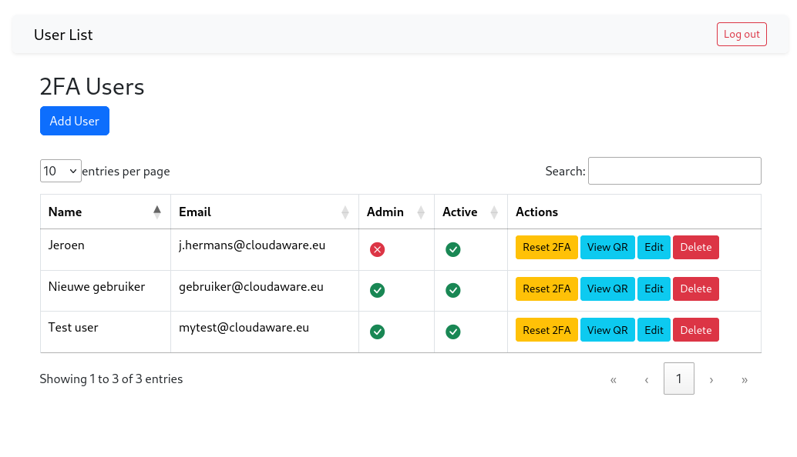

# 2FA Proxy
2FA Proxy is a 2FA proxy portal for non SAML/OpenID/2FA enabled web applications running under Apache.  
It is probably easy to use this application also under NGINX, but this has not been tested.  

No SQL server is used. Because the aim is to make this as portable and lightweight as possible it relies on a file-based 
JSON database (see `2fa/src/Database`). This also means it will run on a very basic hosting platform without MySQL/MariaDb/PostgreSQL).  

The world has fantastic open source SSO solutions like Authelia and Authenik, but i felt a more lightweight solution 
was needed for applications that do not support SAML or potentially for environments where it is technically not possible 
to run such a (fantastic) SSO solution.

## Admin Interface
The admin interface is build with modern interfaces in mind. It relies on datatables, bootstrap and ajax to view users. Clicking on the 
`admin` or `active` columns will toggle these columns for the user in that row. 

## 2FA Providers
2FA Proxy currently supports two 2FA providers:
- TOTP (Google Authenticator)
- Email One-Time-Code

You can find these providers in `2fa/src/Providers`. Feel free to add your own here and if you feel it is relevant for the 
community, feel free to create a PR.
  

## System Requirements
2FA Proxy aims to be as lightweight als possible. There are a few dependancies though
- composer (for installing the dependancies)
- PHP 8.x (not tested with PHP 7, but potentially also works in PHP 7)
- Apache 2.4
- mod_rewrite is enabled in Apache config

Apart from dependancies keep the folling in mind:
- AllowOverride allows mod_rewrite directives in .htaccess files
- The webserver can write in a few (selected) folders)
- You need shell access to change folder owners and run composer

## Installation
- Copy `2fa` and `application` folders to a web folder. Application is an "example" application. This will be your own application eventually.
- in /2fa run `composer update` to install all dependancies
- the .htaccess file in /application manages redirecting to the 2FA portal if not already authenticated
- /2fa/admin/install runs a check whether all files have the correct owners

## TODO
- Make a better installer (initialise an admin user)
- ??

## Trouble shooting
### I get an error `file not found`
Please check if `composer update` installed both the `vendor` and `public` folders

### When i go to application i see no 2FA prompt
Likely .htaccess is not copied to the `application` folders. Another reason can be that your `AllowOverride` are too strict.
If you are not using Apache but NGINX, you can probably also make this work, but then you need to write your own redirect based 
on the `.htaccess` file in the `application` folder.
